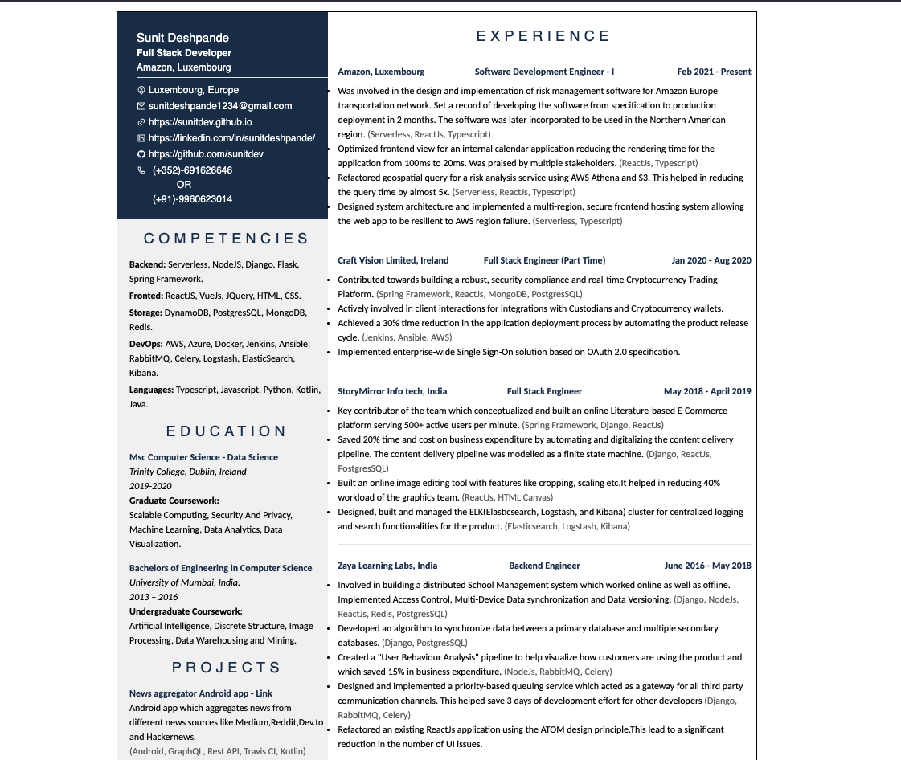

# Resume

[View Online](https://sunitdev.github.io/resume/)

I tried creating my resume with document editing software like Microsoft work and Apple Page. But the software felt too
rigid when it comes to the layout of the document. Therefore I thought, why not create my resume with something I know
the best (Web / Code). And here we have the repo of my resume.

Styling of the page is designed in such a way that when we save the page as a PDF it is saved in the same format as we
would get with any other document editing software.

## Screenshot

